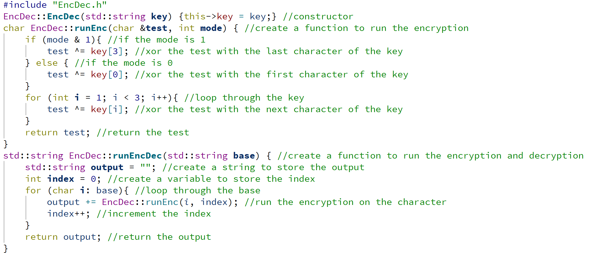
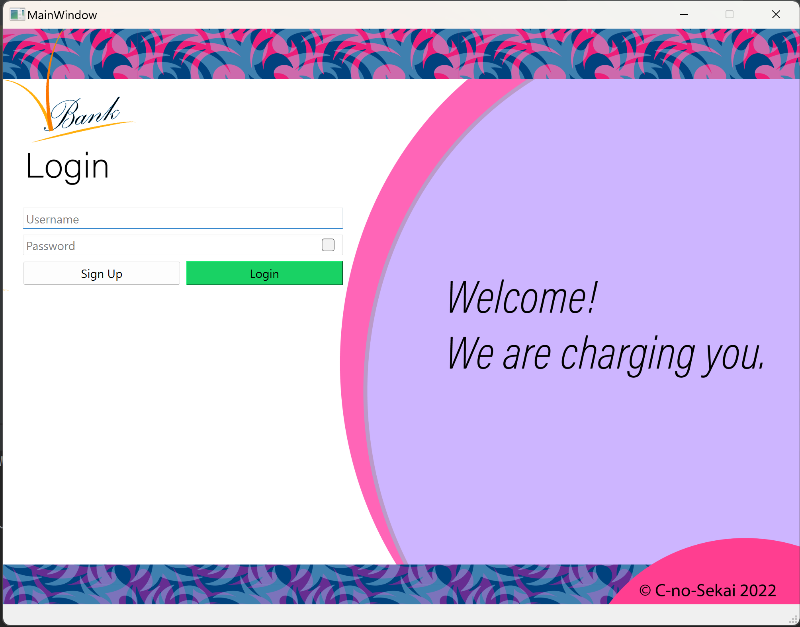

# The Virtual Bank Project

- The repo name translates to Bank, it is encrpyted using the key "gotcha bitch"
- (88xiwfTl9kAcPccoELmUUQ==) => [gotcha bitch] => (Bank)
- A similar key based Symmetric Encryption Algorithm is used in this project.

## Introduction
- Welcome to the "V Bank" Banking Management System!
- This project is a research project that aims to provide a comprehensive banking management solution.
- The system utilizes a client-server architecture, allowing for multiple clients to connect and interact with the system simultaneously.
- The system is designed to be a complete banking management system with all necessary functionalities included such as account creation, money transfer, cash withdrawal, account management, and much more.
- The program is based on modern online banking systems and can handle multiple clients at once without much of a problem.
- **It can run as a proper server and client based system (on multiple computers at once) if configured correctly.**

## Basic Requirements
- A Banking system mainly focused on the operations like adding new customers to the bank, depositing, withdrawing, and transferring money.

## Add-ons
- A proper bank system with loaning feature made in a similar fashion to what normal banks do.
- Different account types such as savings or current.
- A proper encryption-based data transfer for security.
- An ATM made using python, that works synchronously with these bank accounts.

## Technical Overview
- The system uses a custom implementation of the TCP/IP protocol for communication between clients and the server.
- On the server side, **Winsock 2.0**, a Windows Sockets API, is used for handling network communications.
- On the client side, **QTCP**, a QT-based library for creating TCP/IP clients and servers, is used.
- Encryption is done using the **AES** algorithm, which is a symmetric-key algorithm that uses the same key for both encryption and decryption.
- The server uses **SQLite3** as the database management system, providing a lightweight and easy to use solution for data storage.
- **Python** is used for handling some small tasks such as money withdrawals, providing a versatile and powerful scripting language for the system.
- The user interface of the system is built using QT's built-in **XML**, which provides a simple and efficient way to create the front-end.
- The codebase of the project consists of around 4000 lines of plain code, making it a relatively small yet complete solution for banking management.
- Utilizes OOP concepts such as Abstract Classes, Singleton Class, Static Member, Constants, Static and Dynamic Type binding, Inheritance, Encapsulation, Overriding, Polymorphism, and Composition.

## Dependencies
- **QT Creator** must be installed on every client machine.
- **QMake compilation agent** must also be installed, which is used for building the project.
- A **C++ compiler with CMake integration** is also required, as the project uses CMake as the build system.

## Setup
1. Clone the repository from the git.
2. Open the project in **QT Creator**.
3. Build the project using the **QMake compilation agent**.
4. For the Server open the server folder and run the server's C++ file.
5. Now you can run the QT client file.

## Additional Features
- Server-Client Model using Socket Programming.
- Multithreading.
- Symmetric Encryption during datatransfer.

## Screenshots
### Encryption

### Client Connection

### Money Tranfer 

### Running Server With One Client

### Client Side Login Page
Kinda gay I know

### A Random Snippet

- There are many more pages and features not shown here, if you are genuinely interested in it you can fork the repo and check it out yourself.

## Known Issues
- The TCP/IP protocol implementation in the project is a custom implementation, and as such, it may fail to run properly once every ten times.
- This was made as a research project, and as such, it might not be a complete solution for banking management systems, because of that it contains some bugs and might not work on every system because of configuration issues.

## Future Plans
- The project is currently in a working state, but it is not complete. And from the contributors side, it is not going to be updated anymore.
- The project is now open source, and anyone is free to contribute to it and make it better.

## Conclusion
- This project serves as a comprehensive example of how a banking management system can be developed using C++, QT Creator, and various other technologies and how can such a system be built from scratch.
- The system provides a complete solution for banking management, with all the necessary functionalities included, and can serve as a starting point for further development and customization.

## Contributors
- [Abdul Rehman](https://github.com/AR-PyT)
- [Muhammad Taha Mukhtar](https://github.com/tahamukhtar20)

## License
- The project is licensed under the **GNU General Public License Version 2.0** which makes this project fully open source.
